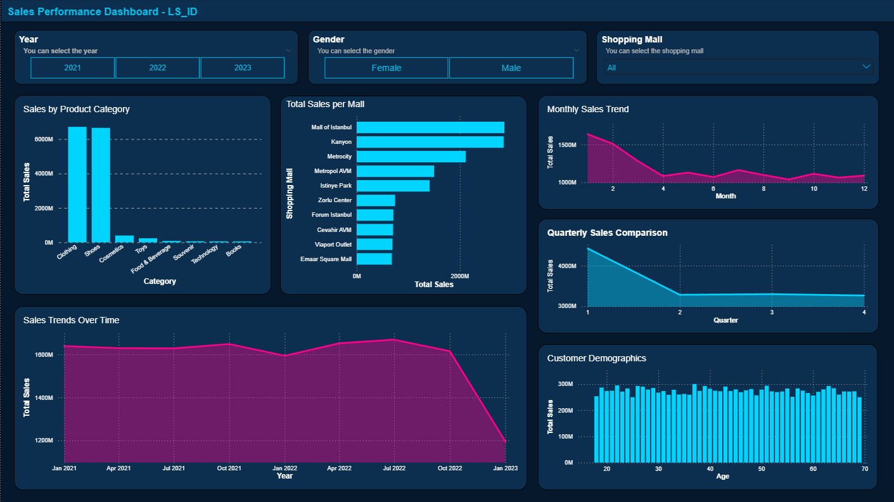

# 🛍️ Sales Performance

## 📌 Project Overview

Analisis ini bertujuan untuk memahami pola penjualan retail dari berbagai kategori produk, lokasi (mall), timeline penjualan (2021–2022), hingga segmentasi konsumen.
Tujuan utama: menghasilkan insight yang berguna untuk strategi bisnis dan pemasaran.

---

## 📂 Raw Dataset

- Dataset: [`customer_shopping_data.csv`](https://www.kaggle.com/datasets/mehmettahiraslan/customer-shopping-dataset/)
- Isi data:

  - `invoice_no`
  - `customer_id`
  - `gender`
  - `age`
  - `category`
  - `quantity`
  - `price`
  - `payment_method`
  - `invoice_date`
  - `shopping_mall`

---

## ❓ Research Questions

1. Kategori produk mana yang menghasilkan total pendapatan tertinggi?
2. Shopping mall mana yang memiliki total penjualan tertinggi?
3. Apakah ada tren musiman dalam pembelian?
4. Apakah ada kategori produk yang lebih sering dibeli oleh kelompok usia tertentu?
5. Kelompok usia mana yang paling banyak menghabiskan uang per transaksi?

---

## 🔍 Data Insight

- **Kategori produk**: Clothing menghasilkan pendapatan tertinggi, disusul sepatu & teknologi.
- **Mall**: Mall of Istanbul & Kanyon unggul, Metrocity menyusul.
- **Timeline**:

  - 2021 → puncak Juli & Oktober, terendah Februari.
  - 2022 → pola mirip dengan Februari terendah & Oktober tertinggi.

- **Tren tahunan**: Februari selalu lemah, Juli & Oktober jadi bulan emas.
- **Segmentasi**: pakaian, kosmetik, makanan diminati semua usia. Spending tertinggi di usia 36–45 tahun (>2500 USD/transaksi).

---

## 📝 Kesimpulan

- Pakaian = mesin uang utama.
- Penjualan mengikuti pola musiman jelas.
- Konsumen 36–45 tahun paling potensial untuk produk premium.
- Lokasi terbaik: Mall of Istanbul & Kanyon.

---

## 💡 Rekomendasi

- Kategori Produk
  Fokus utama ada pada pakaian dengan menambah variasi produk, bundling bersama sepatu atau kosmetik, dan promo musiman. Untuk kategori dengan penjualan rendah seperti buku atau mainan, bisa digencarkan di waktu tertentu, misalnya musim sekolah atau setelah lebaran.

- Mall / Lokasi
  Mall of Istanbul dan Kanyon bisa ditingkatkan stok dan aktivitas marketing karena performanya paling tinggi. Metrocity masih bisa ditingkatkan dengan event atau promo eksklusif. Sementara mall dengan penjualan rendah perlu dievaluasi, apakah masalahnya ada pada traffic pengunjung, lokasi, atau strategi display.

- Timeline Penjualan
  Bulan Februari selalu menjadi titik penjualan terendah sehingga perlu dibuat promo khusus. Bulan Juli dan Oktober konsisten tinggi sehingga stok harus ditambah, iklan diperbesar, dan kampanye digital dimulai lebih awal. Setelah Oktober, biasanya terjadi penurunan di November yang bisa ditutupi dengan campaign akhir tahun seperti promo 12.12.

- Segmentasi Usia
  Kelompok usia 36–45 memiliki pengeluaran paling tinggi, sehingga cocok ditarget dengan produk premium dan berkualitas. Untuk kelompok usia 0–18 tahun lebih sesuai jika ditawarkan produk dengan harga murah atau entry-level.

- **Segmentasi Usia**:

  - 36–45 → produk premium.
  - 0–18 → produk entry-level.

---

## 🛠️ Tools & Library

- **Python**: pandas, matplotlib, seaborn
- **Power BI**: dashboard interaktif

---

## 📊 Power BI Dashboard

Selain menggunakan Python untuk analisis, proyek ini juga dilengkapi dengan dashboard interaktif di Power BI.
Dashboard ini memudahkan stakeholder non-teknis memahami hasil analisis.

**Fitur Utama Dashboard**:

- Visualisasi penjualan berdasarkan kategori & mall
- Tren penjualan bulanan 2021–2022
- Rata-rata pengeluaran per transaksi berdasarkan usia
- Segmentasi demografi & preferensi kategori

**Cuplikan Dashboard**:

---

## 🏁 Hasil Akhir

Analisis menunjukkan bahwa:

- Kategori pakaian mendominasi revenue.
- Februari adalah bulan penjualan terendah, sementara Juli & Oktober menjadi puncak.
- Konsumen usia 36–45 tahun adalah target utama untuk produk premium.
- Mall of Istanbul & Kanyon jadi lokasi paling strategis.

Proyek ini menghasilkan:

- Notebook analisis
- Dashboard interaktif di Power BI
- Rekomendasi strategi bisnis berbasis data
